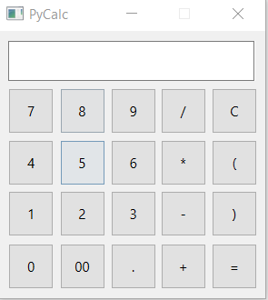
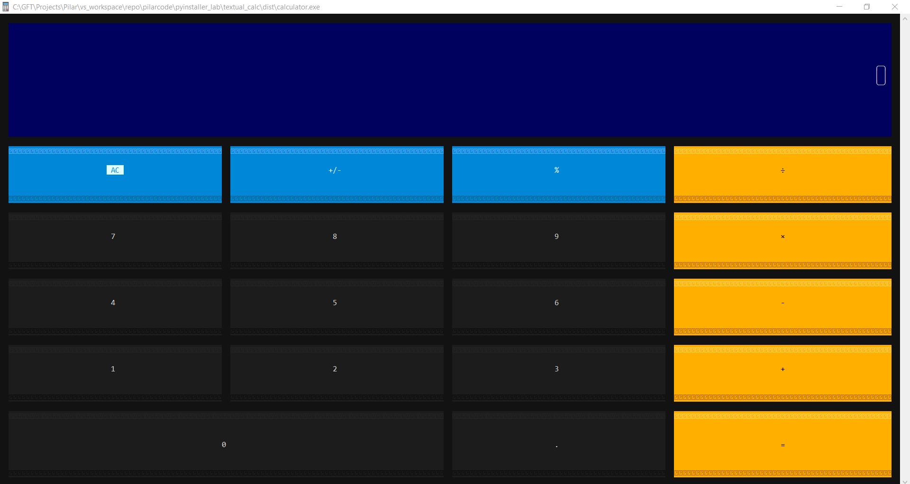

# PyInstaller Lab
This repository contains several projects that I've used to create an executable file with **PyInstaller**.

## PyQt Calc

## Textual Calc

## How to Run
Go to the project folder and follow the README.md instructions.

## References
**PyInstaller** bundles a Python application and all its dependencies into a single package. 

- https://pyinstaller.org/en/stable/index.html
- https://hektorprofe.github.io/python/distribucion/pyinstaller/
- https://github.com/pyinstaller/pyinstaller/wiki/Supported-Packages
